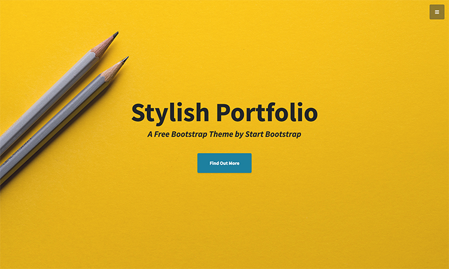

# Lasse's Personal Site

This is the source code for Lasse's personal site, available at [sils.io](https://sils.io). The site is built with Jekyll and based on the [Stylish Portfolio Bootstrap theme](https://startbootstrap.com/template-overviews/stylish-portfolio/).

## About

This is a private site listing stuff Lasse finds interesting. It includes sections on:

*   **Values:** What drives him (Curiosity and Happiness).
*   **Interests:**
    *   Startups
    *   Music
    *   Photography
    *   Software Development
    *   Sports

## Screenshot



## Development

To set up and run the site locally, you'll need to have [Jekyll](https://jekyllrb.com/) installed.

1.  **Clone the repository:**
    ```bash
    git clone https://github.com/sils/sils.io.git
    ```
2.  **Navigate to the project directory:**
    ```bash
    cd sils.io
    ```
3.  **Install dependencies:**
    ```bash
    bundle install
    ```
4.  **Run the Jekyll server:**
    ```bash
    bundle exec jekyll serve
    ```
The site will be available at `http://localhost:4000`.

## License

This project is licensed under the MIT License - see the [LICENSE](LICENSE) file for details.
